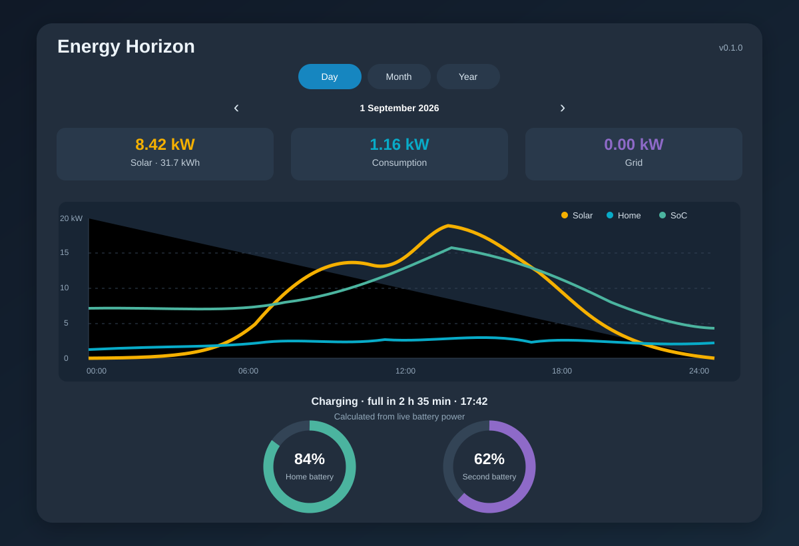
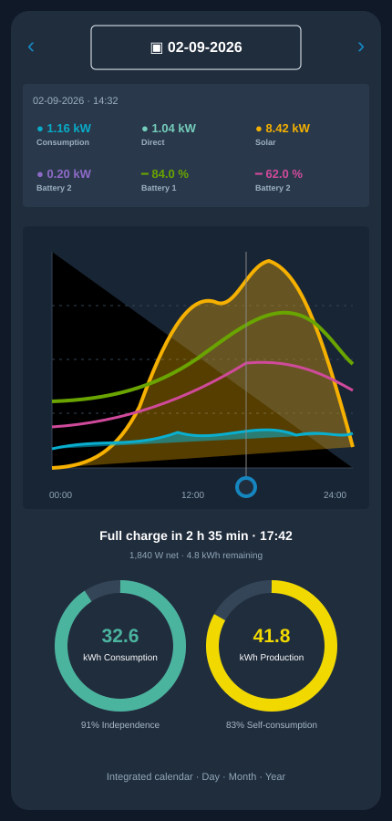
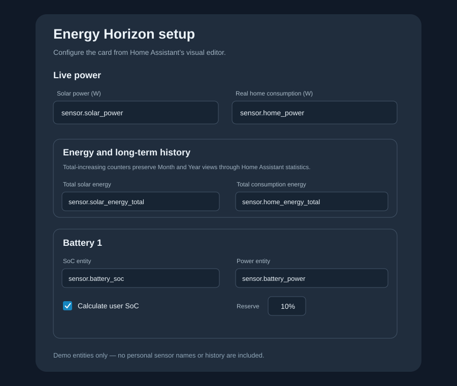

# Energy Horizon Card

Energy Horizon Card is a configurable Home Assistant Lovelace card for solar,
home consumption and battery monitoring. It is vendor-neutral: Growatt,
Marstek, Sonnen and other systems can be used as long as Home Assistant exposes
the required entities.

## Preview



<details>
<summary>Mobile view and setup wizard</summary>





</details>

## Features in 0.2.4

- visual setup wizard in the Lovelace card editor;
- solar production and real home-consumption power;
- Sonnen-inspired day, month and year presentation;
- integrated calendar without the native phone date picker;
- minute-resolution daily production, consumption and battery SoC curves;
- interactive vertical cursor and compact value legend;
- independence and self-consumption rings switchable between percent and kWh;
- optional official daily solar-energy counter;
- up to two batteries in the initial wizard;
- battery capacity, reserve percentage and power-sign configuration;
- optional user SoC calculation:
  `(real SoC - reserve) / (100 - reserve) * 100`;
- optional negative user SoC values;
- combined charge ETA or remaining endurance;
- live capacity-weighted combined-SoC projection at sunset while charging,
  based on the remaining solar curve and current consumption, and at sunrise
  while discharging, using Home Assistant's Sun integration;
- configurable live refresh interval (minimum 5 seconds);
- automatic English, French and Dutch interface based on the Home Assistant
  language, with a manual language override in the visual editor;
- no companion integration and no modification of existing entities.

## HACS installation

1. Publish this folder as a GitHub repository.
2. In HACS, open **Frontend**, then **Custom repositories**.
3. Add the GitHub repository URL and select **Dashboard**.
4. Install **Energy Horizon Card** and reload the browser.
5. Add the card through the Lovelace visual editor.

## Manual installation

Copy `dist/energy-horizon-card.js` to `/config/www/`, register
`/local/energy-horizon-card.js` as a JavaScript module, then add:

```yaml
type: custom:energy-horizon-card
title: Energy Horizon
language: auto
solar_power: sensor.solar_power
solar_energy_today: sensor.solar_energy_today
solar_energy_total: sensor.solar_energy_total
consumption_power: sensor.home_power
consumption_energy_total: sensor.home_energy_total
grid_power: sensor.grid_power
grid_positive: import
grid_import_energy_total: sensor.grid_import_total
grid_export_energy_total: sensor.grid_export_total
batteries:
  - name: Home battery
    soc_entity: sensor.battery_soc
    power_entity: sensor.battery_power
    capacity_kwh: 10
    reserve_percent: 10
    calculate_user_soc: true
    allow_negative_soc: true
    power_positive: charge
refresh_interval: 15
```

`power_positive` must be `charge` when positive battery power means charging,
or `discharge` when it means discharging.

`language` accepts `auto`, `en`, `fr` or `nl`. With `auto`, the card follows
the language selected in Home Assistant and falls back to English.

For exact independence and self-consumption rings in Month and Year views,
configure total-increasing grid import and grid export energy counters. The Day
view can derive these values from the signed grid-power entity.

## Privacy

All calculations run locally in the browser. The card only reads entities from
the user's own Home Assistant instance.

The repository never contains or uploads a user's Recorder history. Day views
read local state history. Month and Year views read local Home Assistant
long-term statistics from the configured total-increasing energy counters.

## Roadmap

- calendar picker and interactive history cursor;
- more than two batteries in the visual editor;
- additional translations;
- optional companion integration to expose calculated user SoC entities;
- import/export presets for common inverter integrations.
