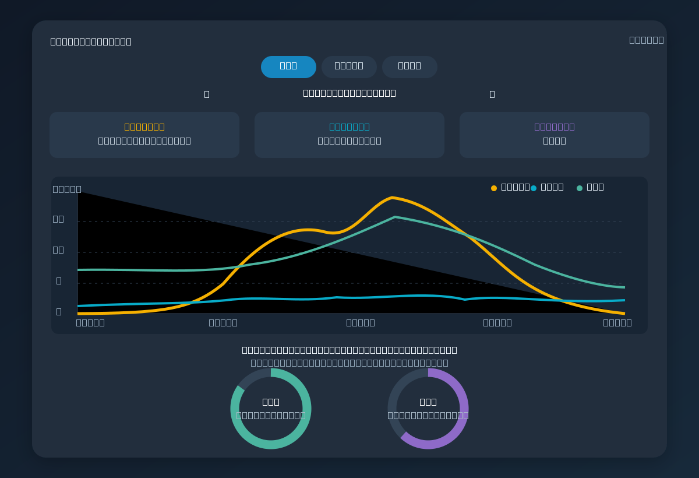

# Energy Horizon Card

A vendor-neutral solar and multi-battery dashboard with a visual setup wizard,
user SoC reserve calculation, live charge ETA and battery endurance.
# Energy Horizon Card

Vendor-neutral solar, home consumption and multi-battery dashboard for Home
Assistant. Configuration is available through the visual Lovelace editor.
